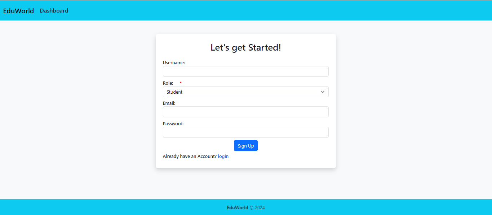

# Learning Management System (LMS)

## Overview

The Learning Management System (LMS) is an online platform designed to facilitate learning interactions between educators and students. It allows educators to create courses, organize content into chapters and pages. Students can sign up, enroll in courses, access course content, mark pages as complete, and view their progress status.

## Features

### For Educators

#### Course Management
- **Create a Course:** Begin by providing a name and description for your course.
- **Build Chapters:** Organize your course into chapters for clear structure.
- **Add Pages:** Populate each chapter with pages.

#### Reports
- **View Enrollment Reports:** Access reports displaying the number of students enrolled in their course(s) and relative popularity based on enrollment numbers.

### For Students

#### Account Management
- **Sign up:** New users can sign up effortlessly by providing their name, email address, and creating a password.
- **Sign in:** Returning users can sign in using their registered email and password.
- **Sign out:** All users have the flexibility to log out when needed.

#### Course Enrollment and Content Access
- **Enroll in a Course:** Gain access to course content and participate in the learning experience.
- **View Chapters List:** Preview the table of contents before enrolling.
- **Display Enrolled Courses:** Access enrolled courses in a dedicated section.
- **Mark Pages as Complete:** Track learning progress by marking pages as completed.
- **Show Progress Status:** View progress status, possibly through a completion percentage.

### Dependencies

- **bcrypt**: Securely hashes passwords for user authentication.
- **body-parser**: Middleware for parsing incoming request bodies.
- **cheerio**: Parses and manipulates HTML and XML documents.
- **connect-ensure-login**: Middleware for ensuring user authentication.
- **connect-flash**: Displays temporary messages to users.
- **cookie-parser**: Middleware for parsing cookies.
- **ejs-mate**: EJS layout and partials plugin for Express.
- **express**: Minimal and flexible web application framework.
- **express-session**: Middleware for handling user sessions.
- **jest**: JavaScript testing framework.
- **markdown-it**: Markdown parser for converting Markdown to HTML.
- **method-override**: Middleware for HTTP method override.
- **nodemon**: Utility for automatically restarting Node.js applications.
- **passport**: Authentication middleware for Node.js.
- **passport-local**: Passport strategy for local authentication.
- **pg**: PostgreSQL client for Node.js.
- **pg-hstore**: Serializes and deserializes JSON data for PostgreSQL.
- **quill**: Modern WYSIWYG editor.
- **sequelize**: Promise-based ORM for Node.js.
- **supertest**: Library for testing HTTP servers.
- **tiny-csrf**: Middleware for CSRF token generation and validation.
- **husky**:pre-commit hook to run tests

## MVC Architecture

The Learning Management System follows the Model-View-Controller (MVC) architecture to ensure a clear separation of concerns and maintainability of the codebase.

## Screenshots 
**Sign up Page**

**Login Page**

**Educator DashBoard**

**Create Course**

**Chapters Page**

**Add Chapter Page**

**Pages**

**Add Page**

**Educator's My Courses Pages**

**Educator Reports**

**Student's DashBoard**

